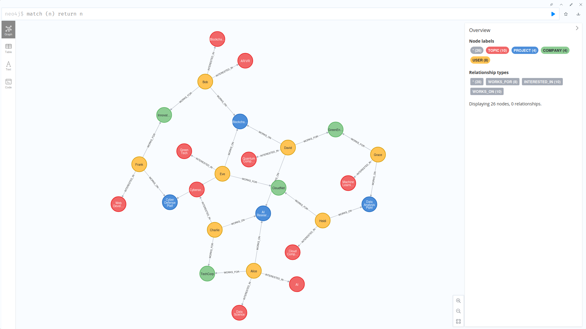
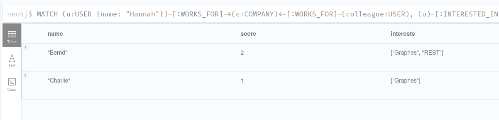
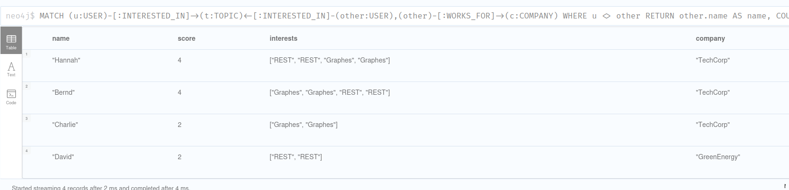
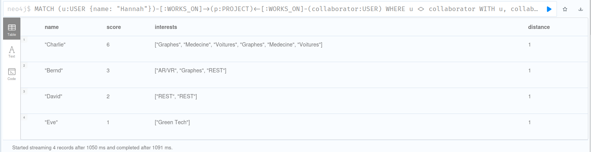
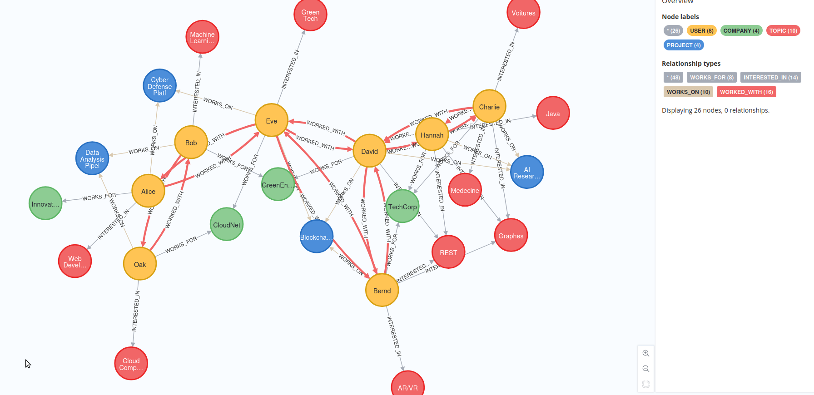

# TD4 - Question 5 - Cas d'usage

## Création de la base de donnée



## Déduire les relations sociales

1.

```cypher
MATCH (u:USER {name: "Hannah"})-[:WORKS_FOR]->(c:COMPANY)<-[:WORKS_FOR]-(colleague:USER), (u)-[:INTERESTED_IN]->(t:TOPIC)<-[:INTERESTED_IN]-(colleague)
WHERE u <> colleague
RETURN colleague.name AS name,
COUNT(t) AS score,
COLLECT(t.name) AS interests
ORDER BY score DESC;
```



2.

```cypher
MATCH (u:USER)-[:INTERESTED_IN]->(t:TOPIC)<-[:INTERESTED_IN]-(other:USER),(other)-[:WORKS_FOR]->(c:COMPANY)
WHERE u <> other
RETURN other.name AS name,
COUNT(t) AS score,
COLLECT(t.name) AS interests, c.name AS company
ORDER BY score DESC;
```



## Trouver des collègues ayant des intérêts particuliers

1.

Cette requête récupère d'abord les collaborateurs directs (distance 1), puis les collaborateurs indirects (distance 2), avant de les associer pour récupérer les cenyre d'intérêts partagés.

```cypher
MATCH (u:USER {name: "Hannah"})-[:WORKS_ON]->(p:PROJECT)<-[:WORKS_ON]-(collaborator:USER)
WHERE u <> collaborator
WITH u, collaborator AS person, 1 AS distance

OPTIONAL MATCH (person)-[:WORKS_ON]->(p2:PROJECT)<-[:WORKS_ON]-(indirectCollaborator:USER)
WHERE indirectCollaborator <> person AND indirectCollaborator <> u
WITH u, COLLECT(DISTINCT person) + COLLECT(DISTINCT indirectCollaborator) AS allPersons, distance

UNWIND allPersons AS person
MATCH (person)-[:INTERESTED_IN]->(t:TOPIC)
WITH person, distance, COLLECT(t.name) AS interests, COUNT(t) AS score
RETURN DISTINCT person.name AS name, score, interests, distance
ORDER BY score DESC, distance;
```



2.

```cypher
MATCH (u1:USER)-[:WORKS_ON]->(p:PROJECT)<-[:WORKS_ON]-(u2:USER)
WHERE u1 <> u2
MERGE (u1)-[:WORKED_WITH]->(u2);
```


Les relations `WORKED_WITH` ont été ajouté sur le graphe (cf. relation rouge), des personnes ayant travaillé ensemble sur un même projet.

3.

```cypher

```
